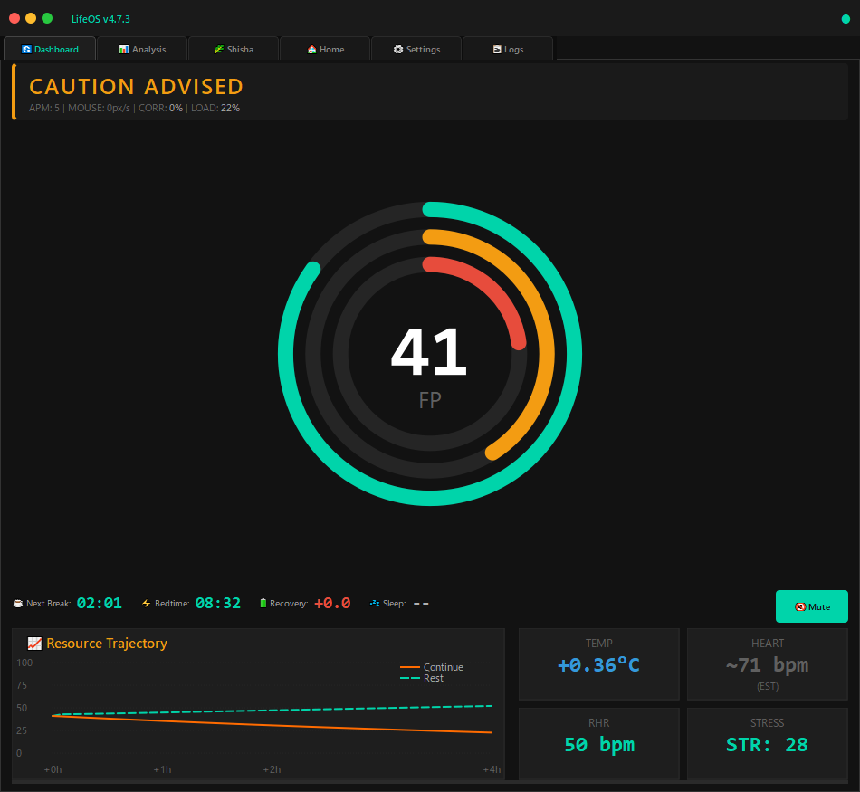

<div align="center">

# 🧬 LifeOS v5.4.1

**Biometric-Driven Productivity System with Neural Acoustic Programming**

**生体データ駆動型プロダクティビティシステム ＋ 神経音響プログラミング**

[](LICENSE)
[](https://python.org)
[](https://ouraring.com)

---

### 💎 Support This Project / このプロジェクトを支援する

**Ethereum / Polygon / BSC / Arbitrum / Base**
```
0x9d8CC17a83b9A75D488E2A15dbcB842AC44a022F
```


---

</div>

---

## 📸 Screenshot / スクリーンショット



---

## 🎯 Overview / 概要

LifeOS is a comprehensive biometric monitoring and productivity optimization system.

LifeOSは、生体データに基づいてあなたの生産性を最適化する統合システムです。

### Features / 機能

| Feature | Description | 機能説明 |
|---------|-------------|----------|
| **Oura Ring Integration** | Sleep, Readiness, Heart Rate tracking | 睡眠・準備スコア・心拍数を追跡 |
| **BioEngine** | Real-time Focus Points (FP) calculation | リアルタイムの集中力ポイント算出 |
| **Shadow Heartrate** | APM-based HR estimation during API latency | API遅延時のAPMベース心拍推定 |
| **Neural Acoustic Engine** | Binaural beats & ambient soundscapes | バイノーラルビート＆環境音響 |
| **Home Automation** | Philips Hue & Sony Bravia sync | 照明・TVとの自動連携 |

---

## 🏗️ Architecture / アーキテクチャ

```
LifeOS/
├── LifeOS_GUI.py          # Main GUI / メインインターフェース
├── config.json            # Your settings / あなたの設定
├── core/
│   ├── types.py           # Type definitions / 型定義
│   ├── database.py        # SQLite database / データベース
│   ├── engine.py          # BioEngine core / 生体エンジン
│   ├── audio.py           # Neural sound / 神経音響
│   ├── daemon.py          # Background process / バックグラウンド処理
│   └── home.py            # Smart home / スマートホーム連携
├── Data/
│   └── style.qss          # UI stylesheet / UIスタイル
└── logs/                  # Runtime logs / 実行ログ
```

---

## 📋 Requirements / 必要環境

```
Python >= 3.7
PyQt5
pygame
numpy
pynput
requests
scipy (optional / オプション)
phue (optional, for Hue / Hue連携用)
```

---

## 🚀 Quick Start / クイックスタート

```bash
# 1. Clone / クローン
git clone https://github.com/moycoin/LifeOS.git
cd LifeOS

# 2. Install dependencies / 依存関係インストール
pip install -r requirements.txt

# 3. Configure / 設定
cp config.example.json config.json
# Edit config.json with your Oura API token
# config.jsonにOura APIトークンを設定

# 4. Run / 実行
python LifeOS_GUI.py
```

---

## ⚙️ Configuration / 設定

Copy `config.example.json` to `config.json`:

`config.example.json`を`config.json`にコピーして編集：

| Key | Description | 説明 |
|-----|-------------|------|
| `oura.api_token` | Oura API Personal Access Token | Oura APIトークン |
| `oura.rhr` | Your resting heart rate | 安静時心拍数 |
| `audio.*` | Audio engine settings | 音響エンジン設定 |
| `home.*` | Smart home device IPs | スマートホームIP |
| `openai.*` | OpenAI API for voice | 音声合成API |

---

## 🔬 Core Concepts / コアコンセプト

### Focus Points (FP) / 集中力ポイント

A composite metric representing cognitive resource availability.

認知リソースの可用性を表す複合指標。

```
FP_effective = Base_FP + (Boost_FP × Efficiency) - (Debt × Penalty)
```

### Shadow Heartrate / シャドウ心拍

Real-time HR estimation when Oura data is delayed (typically 2-3 hours).

Ouraデータ遅延時（通常2-3時間）のリアルタイム心拍推定。

```
HR_pred = HR_base + AWAKE_OFFSET + (APM × α) + (Mouse × β) + (WorkTime × γ)
```

### Neural Acoustic Programming / 神経音響プログラミング

| Mode | Frequency | Purpose | 用途 |
|------|-----------|---------|------|
| Focus | 40Hz (Gamma) | Deep concentration | 深い集中 |
| Flow | 14Hz (Beta) | Productive state | 生産的状態 |
| Relax | 10Hz (Alpha) | Light relaxation | 軽いリラックス |
| Sleep | 2Hz (Delta) | Sleep induction | 睡眠誘導 |

---

## 📊 Database Schema / データベース構造

| Table | Purpose | 用途 |
|-------|---------|------|
| `daily_logs` | Readiness, Sleep, RHR | 日次スコア |
| `tactile_logs` | APM, keystrokes, states | 操作ログ |
| `heartrate_logs` | HR stream (Oura + Shadow) | 心拍ストリーム |
| `shisha_logs` | Session tracking | セッション記録 |

---

## 🤝 Contributing / コントリビューション

Contributions welcome. Please maintain:

コントリビューション歓迎。以下を維持してください：

- Python 3.7 compatible syntax / Python 3.7互換
- High-density formatting / 高密度フォーマット
- Minimal comments / コメント最小限

---

## 📜 License / ライセンス

MIT License - Copyright (c) 2025 [@moycoin](https://twitter.com/moycoin)

See [LICENSE](LICENSE) for details. / 詳細は[LICENSE](LICENSE)を参照。

---

<div align="center">

**Created with 🧠 by [@moycoin](https://twitter.com/moycoin)**

*"Optimize your biology, amplify your cognition."*

*「生体を最適化し、認知を増幅せよ。」*

</div>
