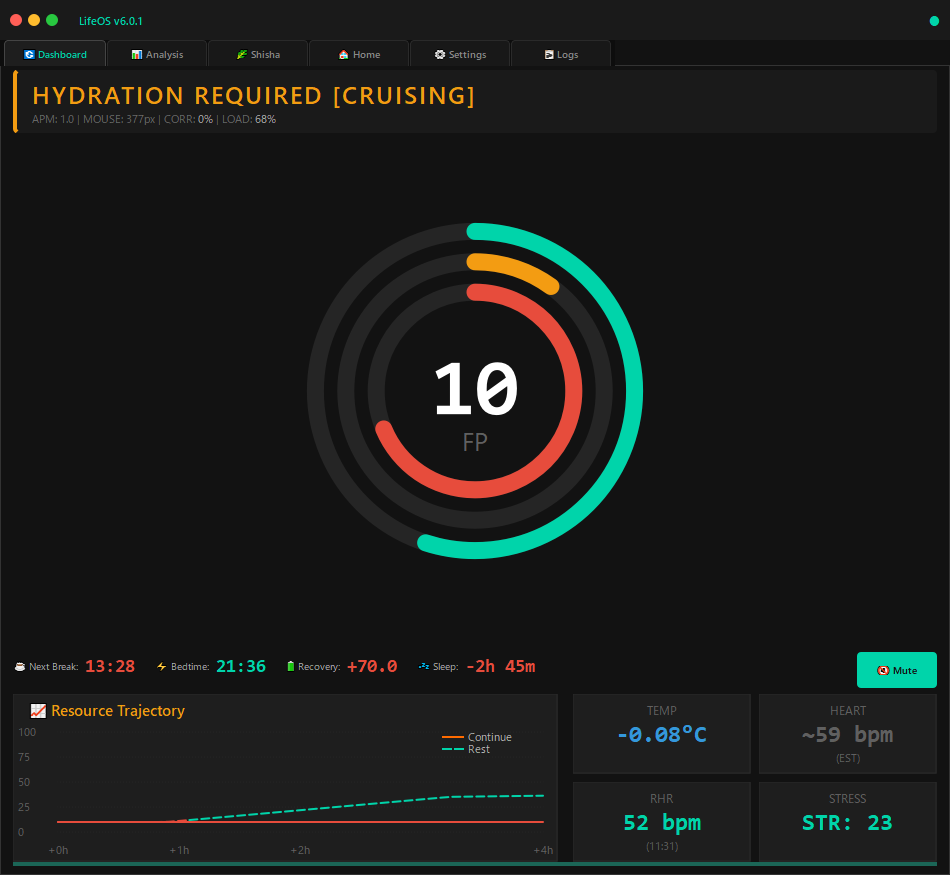
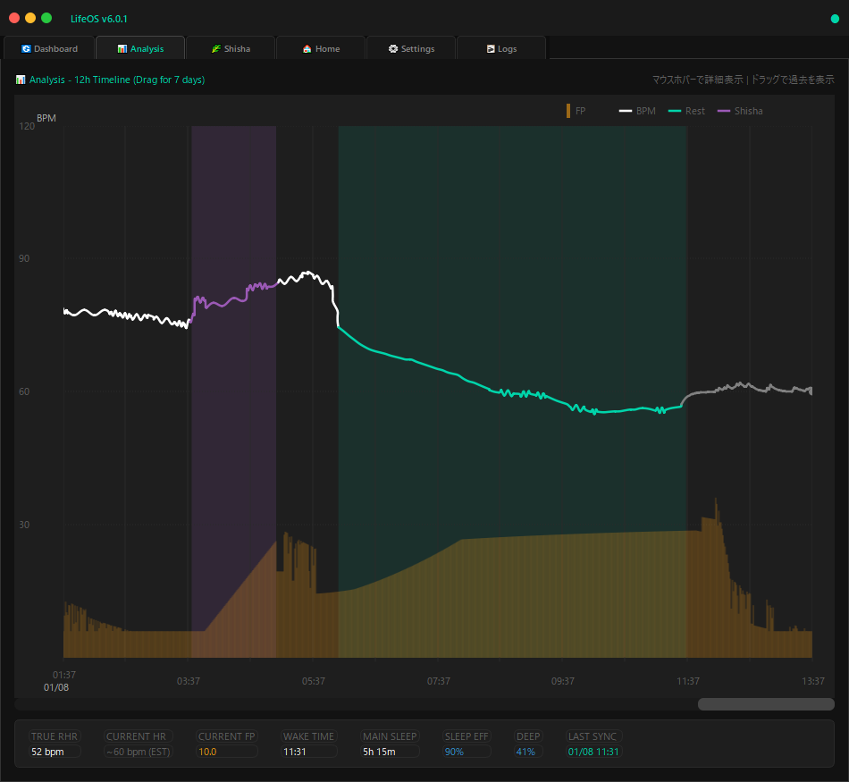

<div align="center">

# 🧬 LifeOS v6.2

**Biometric-Driven Cognitive Operating System**

**生体データ駆動型 認知オペレーティングシステム**

[](LICENSE)
[](https://python.org)
[](https://ouraring.com)
[](#-architecture--アーキテクチャ)

<br>

*Your biology is your operating system. LifeOS is the interface.*

*あなたの生体がOSであり、LifeOSはそのインターフェースである。*

<br>

### 💎 Support This Project / このプロジェクトを支援

**Ethereum / Polygon / BSC / Arbitrum / Base**
```
0x9d8CC17a83b9A75D488E2A15dbcB842AC44a022F
```

</div>

---

## 📸 Screenshots / スクリーンショット

<div align="center">

| Dashboard | Analysis Timeline |
|:---------:|:-----------------:|
|  |  |

</div>

---

## 🎯 What is LifeOS? / LifeOSとは？

LifeOS is not just another productivity tracker. It's a **real-time cognitive resource management system** that treats your brain like a computer—monitoring available resources, predicting exhaustion, and optimizing your work-rest cycles.

LifeOSは単なる生産性トラッカーではありません。**リアルタイム認知リソース管理システム**であり、あなたの脳をコンピュータのように扱います—利用可能なリソースを監視し、疲労を予測し、作業と休息のサイクルを最適化します。

### The Problem / 課題

| Traditional Approach | Reality | 従来のアプローチ | 現実 |
|---------------------|---------|------------------|------|
| "I feel tired" | Too late—you've already crashed | 「疲れた」と感じる | 既に限界を超えている |
| Oura's daily score | Updated once, stale by afternoon | Ouraの日次スコア | 1日1回更新、午後には古い |
| Time-based breaks | Ignores your actual state | 時間ベースの休憩 | 実際の状態を無視 |

### The Solution / 解決策

LifeOS calculates **Focus Points (FP)** in real-time by fusing:

LifeOSは以下を融合して**Focus Points (FP)**をリアルタイム算出：

```
┌─────────────────────────────────────────────────────────────────┐
│                         FOCUS POINTS                            │
│  ┌──────────────┐   ┌──────────────┐   ┌──────────────────┐    │
│  │ Oura Data    │ + │ Activity     │ + │ Time Modeling    │    │
│  │ - Readiness  │   │ - APM        │   │ - Wake duration  │    │
│  │ - Sleep      │   │ - Mouse      │   │ - Decay curves   │    │
│  │ - HRV        │   │ - Patterns   │   │ - Break recovery │    │
│  └──────────────┘   └──────────────┘   └──────────────────┘    │
└─────────────────────────────────────────────────────────────────┘
```

---

## 🧠 Design Philosophy / 設計思想

### Why Not Just Use Oura's Scores? / なぜOuraのスコアをそのまま使わないのか？

Oura Ring provides excellent sleep and readiness data, but:

Oura Ringは優れた睡眠・準備データを提供しますが：

| Limitation | Impact | 制限 | 影響 |
|------------|--------|------|------|
| Daily score updates once | Stale by afternoon | 日次スコアは1回更新 | 午後には古くなる |
| 2-3 hour HR sync delay | No real-time feedback | 心拍同期に2-3時間遅延 | リアルタイムフィードバック不可 |
| No activity correlation | Ignores work patterns | 活動との相関なし | 作業パターンを無視 |
| Binary "ready/not ready" | Too simplistic | 「準備OK/NG」の二値 | 単純すぎる |

**LifeOS bridges these gaps with predictive modeling.**

**LifeOSは予測モデリングでこれらのギャップを埋めます。**

### The SSOT Principle / SSOTの原則

LifeOS follows **Single Source of Truth (SSOT)** architecture:

LifeOSは**Single Source of Truth (SSOT)**アーキテクチャに従います：

```
┌─────────────────────────────────────────────────────────────────┐
│                                                                 │
│    ┌──────────────┐                      ┌──────────────┐      │
│    │              │                      │              │      │
│    │    DAEMON    │──────WRITE──────────▶│   DATABASE   │      │
│    │   (Writer)   │                      │   (Truth)    │      │
│    │              │                      │              │      │
│    └──────────────┘                      └──────────────┘      │
│          │                                      ▲              │
│          │                                      │              │
│          ▼                                      │              │
│    ┌──────────────┐                      ┌──────────────┐      │
│    │  Oura API    │                      │     GUI      │      │
│    │  APM Input   │                      │   (Reader)   │──READ│
│    │  HR Calc     │                      │  Display Only│      │
│    └──────────────┘                      └──────────────┘      │
│                                                                 │
└─────────────────────────────────────────────────────────────────┘
```

**Critical Rule: The GUI NEVER calculates. It only reflects.**

**鉄則：GUIは絶対に計算しない。反映するのみ。**

This separation ensures:
- Consistent state across restarts / 再起動後も状態が一貫
- No race conditions / 競合状態なし
- Testable business logic / ビジネスロジックのテスト可能性
- Clean crash recovery / クリーンなクラッシュリカバリ

---

## 🔬 Core Concepts / コアコンセプト

### Focus Points (FP) / 集中力ポイント

FP represents your **available cognitive resources** on a 0-100 scale.

FPは0-100スケールで**利用可能な認知リソース**を表します。

#### Calculation / 計算式

```python
# Step 1: Initial FP from Oura data
initial_fp = readiness × 0.7 + sleep_score × 0.3

# Step 2: Time-based decay (exponential)
decay_rate = {
    'optimal': 0.06,   # Readiness 80+
    'good': 0.08,      # Readiness 60-79
    'low': 0.12,       # Readiness 40-59
    'critical': 0.18   # Readiness <40
}
base_fp = initial_fp × exp(-decay_rate × hours_since_wake)

# Step 3: Activity modifiers
effective_fp = base_fp + break_recovery - cognitive_debt
```

#### FP Zones / FPゾーン

| FP Range | Status | Color | Meaning | 意味 |
|----------|--------|-------|---------|------|
| 70-100 | OPTIMAL | 🟢 Green | Peak performance window | ピークパフォーマンス |
| 50-69 | FLOW | 🔵 Cyan | Sustainable productivity | 持続可能な生産性 |
| 30-49 | CAUTION | 🟡 Orange | Consider a break | 休憩を検討 |
| 10-29 | EXHAUSTED | 🔴 Red | Break required | 休憩必須 |
| 0-9 | CRITICAL | ⚫ Dark | Stop working | 作業停止 |

#### Decay Curve Visualization / 減衰曲線の可視化

```
FP
100│●
   │ ╲
 80│  ╲___
   │      ╲
 60│       ╲___      ← Break recovery spike
   │           ╲    ↗
 40│            ╲__╱  ╲
   │                   ╲___
 20│                       ╲
   │                        ╲___
  0└────────────────────────────────▶ Hours since wake
   0    2    4    6    8   10   12   14   16
```

---

### Shadow Heartrate / シャドウ心拍

#### The 2-3 Hour Problem / 2-3時間問題

Oura Ring syncs heart rate data with significant delay:

Oura Ringは心拍データを大幅な遅延で同期します：

```
Timeline:
09:00 - You wake up, start working
09:30 - Intense coding session begins
10:00 - Heart rate spikes to 95 BPM
        ↓
        [Oura hasn't synced this yet]
        ↓
12:30 - Finally appears in Oura API ← 2.5 hour delay!
```

#### The Solution: APM-Based Estimation / 解決策：APMベース推定

```python
class ShadowHeartrate:
    """Real-time HR estimation from activity patterns"""
    
    AWAKE_OFFSET = 15        # Baseline increase when awake
    APM_COEFFICIENT = 0.08   # HR increase per APM
    MOUSE_COEFFICIENT = 0.02 # HR increase per mouse speed
    TIME_COEFFICIENT = 0.5   # HR increase per work hour
    
    def estimate(self, rhr, apm, mouse_speed, hours_worked):
        return (
            rhr 
            + self.AWAKE_OFFSET
            + (apm * self.APM_COEFFICIENT)
            + (mouse_speed * self.MOUSE_COEFFICIENT)
            + (hours_worked * self.TIME_COEFFICIENT)
        )
```

#### Validation / 検証

When Oura data finally arrives, LifeOS compares estimated vs actual:

Ouraデータが到着すると、LifeOSは推定値と実測値を比較：

```
Estimated: 78 BPM  │  Actual: 81 BPM  │  Error: 3.8%
```

Typical accuracy: **±5 BPM** during normal activity.

通常の活動中の精度：**±5 BPM**

---

### Neural Acoustic Programming / 神経音響プログラミング

LifeOS includes a sophisticated audio engine that adapts to your cognitive state:

LifeOSは認知状態に適応する高度なオーディオエンジンを搭載：

#### Brainwave Entrainment / 脳波エントレインメント

| State | Target Frequency | Binaural Beat | Effect |
|-------|-----------------|---------------|--------|
| **Focus** | 40Hz Gamma | 400Hz / 440Hz | Deep concentration, problem-solving |
| **Flow** | 14Hz Beta | 200Hz / 214Hz | Sustained productivity |
| **Relax** | 10Hz Alpha | 180Hz / 190Hz | Light relaxation, creativity |
| **Sleep** | 2Hz Delta | 100Hz / 102Hz | Sleep induction |

#### 7-Channel Audio Architecture / 7チャンネルオーディオ構成

```
Channel 0-1: BGM (Binaural carrier + ambient)
Channel 2-4: Ambient layers (Rain, nature, etc.)
Channel 5:   Voice notifications
Channel 6:   SFX / Shisha timer alerts
```

#### State Inertia / 状態慣性

Audio doesn't change immediately—it uses "inertia" to prevent jarring transitions:

オーディオは即座に変化せず、「慣性」で急激な遷移を防止：

```python
# State must persist for 30+ seconds before audio adapts
if time_in_state > STATE_INERTIA_SECONDS:
    transition_to_new_audio_state()
```

---

## 🏗️ Architecture / アーキテクチャ

### Directory Structure / ディレクトリ構造

```
LifeOS/
├── LifeOS_GUI.py              # Main entry point (3400+ lines)
│                               # PyQt5 GUI, pure reader
├── config.json                 # User configuration
│
├── core/
│   ├── types.py               # Shared constants, enums, types
│   │                           # Colors, Fonts, ActivityState
│   │
│   ├── database.py            # SQLite with WAL mode
│   │                           # Thread-safe, atomic operations
│   │
│   ├── engine.py              # BioEngine - FP calculation core
│   │                           # Decay modeling, predictions
│   │
│   ├── daemon.py              # Background processor (SSOT writer)
│   │   ├── OuraAPIClient      # Oura Ring API integration
│   │   ├── InputTelemetry     # APM/mouse tracking
│   │   ├── ShadowHeartrate    # HR estimation
│   │   └── LifeOSDaemon       # Main loop (1-second tick)
│   │
│   ├── audio.py               # Neural acoustic engine
│   │   ├── NeuroSoundEngine   # 7-channel audio mixing
│   │   └── NeuroSoundController # State-based adaptation
│   │
│   └── home.py                # Smart home integration
│                               # Philips Hue, Sony Bravia
│
├── Data/
│   ├── life_os.db             # SQLite database
│   ├── style.qss              # Qt stylesheet
│   ├── sounds/                # Audio assets
│   │   ├── bgm/               # Background music
│   │   ├── ambient/           # Ambient sounds
│   │   └── shisha/            # Timer voice alerts
│   └── vocab.json             # NLC vocabulary
│
└── logs/
    └── daemon.pid             # Process lock file
```

### Component Interaction / コンポーネント相互作用

```
┌─────────────────────────────────────────────────────────────────────────┐
│                              LifeOS System                               │
├─────────────────────────────────────────────────────────────────────────┤
│                                                                         │
│  ┌─────────────┐     ┌─────────────┐     ┌─────────────────────────┐   │
│  │ Oura Cloud  │────▶│ OuraAPI     │────▶│                         │   │
│  └─────────────┘     │ Client      │     │                         │   │
│                      └─────────────┘     │                         │   │
│  ┌─────────────┐     ┌─────────────┐     │      LifeOSDaemon       │   │
│  │ Keyboard    │────▶│ Input       │────▶│                         │   │
│  │ Mouse       │     │ Telemetry   │     │  ┌───────────────────┐  │   │
│  └─────────────┘     └─────────────┘     │  │    BioEngine      │  │   │
│                                          │  │  - FP Calculation │  │   │
│  ┌─────────────┐     ┌─────────────┐     │  │  - Predictions    │  │   │
│  │ Shadow HR   │────▶│ HR Estimate │────▶│  │  - Status Codes   │  │   │
│  └─────────────┘     └─────────────┘     │  └───────────────────┘  │   │
│                                          │            │            │   │
│                                          └────────────┼────────────┘   │
│                                                       │                │
│                                                       ▼                │
│                                          ┌─────────────────────────┐   │
│                                          │    SQLite Database      │   │
│                                          │    (WAL Mode)           │   │
│                                          │  ┌───────────────────┐  │   │
│                                          │  │ brain_metrics     │  │   │
│                                          │  │ heartrate_logs    │  │   │
│                                          │  │ daily_logs        │  │   │
│                                          │  │ tactile_logs      │  │   │
│                                          │  └───────────────────┘  │   │
│                                          └─────────────────────────┘   │
│                                                       │                │
│                                                       ▼                │
│  ┌───────────────────────────────────────────────────────────────────┐ │
│  │                         LifeOS GUI                                │ │
│  │  ┌─────────┐ ┌─────────┐ ┌─────────┐ ┌─────────┐ ┌─────────────┐ │ │
│  │  │Dashboard│ │Analysis │ │ Shisha  │ │  Home   │ │  Settings   │ │ │
│  │  │  Tab    │ │  Tab    │ │   Tab   │ │   Tab   │ │    Tab      │ │ │
│  │  └─────────┘ └─────────┘ └─────────┘ └─────────┘ └─────────────┘ │ │
│  └───────────────────────────────────────────────────────────────────┘ │
│                                                                         │
└─────────────────────────────────────────────────────────────────────────┘
```

### Database Schema / データベーススキーマ

```sql
-- Real-time brain state (written every second)
CREATE TABLE brain_metrics (
    id INTEGER PRIMARY KEY,
    timestamp TEXT NOT NULL,
    effective_fp REAL,
    base_fp REAL,
    cognitive_load REAL,
    activity_state TEXT,
    status_code TEXT,
    state_label TEXT,
    estimated_hr REAL,
    is_hr_estimated INTEGER
);

-- Heart rate stream (Oura + Shadow combined)
CREATE TABLE heartrate_logs (
    id INTEGER PRIMARY KEY,
    timestamp TEXT NOT NULL,
    bpm INTEGER NOT NULL,
    source TEXT DEFAULT 'oura'  -- 'oura' or 'shadow'
);

-- Daily Oura data
CREATE TABLE daily_logs (
    id INTEGER PRIMARY KEY,
    date TEXT UNIQUE NOT NULL,
    readiness INTEGER,
    sleep_score INTEGER,
    hrv_balance REAL,
    rhr INTEGER,
    main_sleep_seconds INTEGER
);

-- Activity telemetry
CREATE TABLE tactile_logs (
    id INTEGER PRIMARY KEY,
    timestamp TEXT NOT NULL,
    effective_apm INTEGER,
    key_count INTEGER,
    mouse_distance REAL,
    activity_state TEXT
);
```

---

## 📋 Requirements / 必要環境

### Hardware / ハードウェア

| Required | Optional | 必須 | オプション |
|----------|----------|------|----------|
| **Oura Ring** (Gen 2/3) | Philips Hue Bridge | **Oura Ring** (第2/3世代) | Philips Hueブリッジ |
| Computer with Python | Sony Bravia TV | Python実行可能PC | Sony Bravia TV |

### Software / ソフトウェア

```
Python >= 3.7 (3.8+ syntax NOT supported)

# Core dependencies
PyQt5>=5.15.0      # GUI framework
pygame>=2.0.0      # Audio engine
numpy>=1.19.0      # Numerical computing
requests>=2.25.0   # HTTP client
pynput>=1.7.0      # Input monitoring

# Optional
scipy>=1.5.0       # Advanced signal processing
phue>=1.1          # Philips Hue control
openai>=0.27.0     # Voice synthesis (TTS)
```

---

## 🚀 Installation / インストール

### Step 1: Clone Repository / リポジトリをクローン

```bash
git clone https://github.com/moycoin/LifeOS.git
cd LifeOS
```

### Step 2: Create Virtual Environment (Recommended) / 仮想環境作成（推奨）

```bash
# Windows
python -m venv venv
venv\Scripts\activate

# macOS/Linux
python3 -m venv venv
source venv/bin/activate
```

### Step 3: Install Dependencies / 依存関係インストール

```bash
pip install -r requirements.txt
```

### Step 4: Get Oura API Token / Oura APIトークン取得

1. Go to [Oura Developer Portal](https://cloud.ouraring.com/personal-access-tokens)
2. Create a new Personal Access Token
3. Copy the token (you won't see it again!)

### Step 5: Configure / 設定

```bash
cp config.example.json config.json
```

Edit `config.json`:

```json
{
  "oura": {
    "api_token": "YOUR_OURA_TOKEN_HERE",
    "rhr": 45
  },
  "audio": {
    "enabled": true,
    "bgm_volume": 0.08,
    "ambient_volume": 0.15,
    "voice_volume": 0.5
  },
  "home": {
    "hue_bridge_ip": "",
    "hue_room": "Office",
    "bravia_ip": "",
    "bravia_psk": ""
  },
  "openai": {
    "api_key": ""
  }
}
```

### Step 6: Run / 実行

```bash
python LifeOS_GUI.py
```

---

## ⚙️ Configuration Details / 設定詳細

### Oura Settings / Oura設定

| Key | Type | Description | 説明 |
|-----|------|-------------|------|
| `api_token` | string | Personal Access Token | 個人アクセストークン |
| `rhr` | integer | Your resting heart rate (from Oura app) | 安静時心拍数（Ouraアプリから） |

### Audio Settings / オーディオ設定

| Key | Type | Default | Description |
|-----|------|---------|-------------|
| `enabled` | bool | true | Enable audio engine |
| `bgm_volume` | float | 0.08 | Background music volume (0-1) |
| `ambient_volume` | float | 0.15 | Ambient sound volume (0-1) |
| `voice_volume` | float | 0.5 | Voice notification volume (0-1) |
| `state_inertia_seconds` | int | 30 | Seconds before audio state changes |

### Smart Home Settings / スマートホーム設定

| Key | Description | How to Find |
|-----|-------------|-------------|
| `hue_bridge_ip` | Philips Hue Bridge IP | Hue app → Settings → Bridge |
| `hue_room` | Room name to control | Must match Hue app exactly |
| `bravia_ip` | Sony Bravia TV IP | TV Settings → Network |
| `bravia_psk` | Pre-Shared Key | TV Settings → Home Network → IP Control |

---

## 🖥️ GUI Overview / GUI概要

### Dashboard Tab / ダッシュボードタブ

The main control center showing real-time status:

リアルタイム状態を表示するメインコントロールセンター：

```
┌─────────────────────────────────────────────────────────────┐
│  ║ FLOW [Sustainable]                                       │
│  ║ APM: 45 | MOUSE: 120px/s | CORR: 87%                    │
├─────────────────────────────────────────────────────────────┤
│                                                             │
│                    ┌─────────────┐                          │
│                    │             │                          │
│                    │     67      │  ← Current FP            │
│                    │     FP      │                          │
│                    │             │                          │
│                    └─────────────┘                          │
│          Readiness ═══════════════════ 75%                  │
│          FP        ══════════════════  67%                  │
│          Load      ═══════          35%                     │
│                                                             │
├─────────────────────────────────────────────────────────────┤
│  ☕ Break: 2h 15m  │  ⚡ Bedtime: 6h 30m  │  💤 Sleep: +1h  │
└─────────────────────────────────────────────────────────────┘
```

### Analysis Tab / 分析タブ

7-day timeline with heart rate, FP, and sleep visualization:

心拍数、FP、睡眠を可視化する7日間タイムライン：

- **White line**: Heart rate (BPM)
- **Cyan line**: Rest periods (low HR during sleep)
- **Orange bars**: FP levels over time
- **Green background**: Detected sleep periods
- **Red vertical lines**: Midnight markers with date

### Shisha Tab / シーシャタブ

5-stage timer for hookah sessions with voice guidance:

音声ガイダンス付き5段階フッカセッションタイマー：

1. **Ignition** (15:30) - Initial coal heating
2. **Ventilation** (4:00) - Air circulation
3. **Heat Soak** (8:30) - Temperature stabilization
4. **Calibration** (3:00) - Final adjustment
5. **Cruise** (50:00) - Main session

---

## 🔧 Troubleshooting / トラブルシューティング

### Common Issues / よくある問題

#### "No Oura data" / Ouraデータなし

```bash
# Check API token validity
curl -H "Authorization: Bearer YOUR_TOKEN" \
  "https://api.ouraring.com/v2/usercollection/daily_readiness"
```

#### GUI shows stale data / GUIが古いデータを表示

The daemon may have crashed. Check:

```bash
# View daemon status
cat logs/daemon.pid

# Restart by closing and reopening GUI
```

#### Audio not playing / オーディオが再生されない

1. Check `config.json` → `audio.enabled: true`
2. Verify `Data/sounds/` directory exists with audio files
3. Check pygame mixer initialization in console output

#### High CPU usage / CPU使用率が高い

The Analysis tab's timeline rendering can be intensive:

- Scroll smoothly (don't spam scroll)
- The system uses buffer caching—first render is slow, subsequent are fast

---

## 🛠️ Development / 開発

### Code Style / コードスタイル

LifeOS follows a **high-density competitive programming style**:

```python
# ✅ Good - Dense, efficient
def calc_fp(r, s, h): return max(10, min(100, (r * 0.7 + s * 0.3) * math.exp(-0.08 * h)))

# ❌ Bad - Too verbose
def calculate_focus_points(readiness, sleep_score, hours_since_wake):
    initial_fp = readiness * 0.7 + sleep_score * 0.3
    decay_factor = math.exp(-0.08 * hours_since_wake)
    raw_fp = initial_fp * decay_factor
    clamped_fp = max(10, min(100, raw_fp))
    return clamped_fp
```

### Key Constraints / 主要制約

| Rule | Reason | ルール | 理由 |
|------|--------|--------|------|
| Python 3.7 syntax only | Compatibility | Python 3.7構文のみ | 互換性 |
| No walrus operator `:=` | 3.8+ feature | ウォルラス演算子禁止 | 3.8以降の機能 |
| Minimal comments | Code should self-document | コメント最小限 | 自己文書化 |
| No decorative lines | High information density | 装飾行禁止 | 高情報密度 |

### Adding New Features / 新機能追加

1. **State changes** → Modify `daemon.py`
2. **Display changes** → Modify `LifeOS_GUI.py`
3. **New metrics** → Add to `database.py` schema + `engine.py` calculation
4. **Never** add calculations to GUI—always go through daemon

---

## 📊 Data Export / データエクスポート

### SQLite Direct Access / SQLite直接アクセス

```bash
sqlite3 Data/life_os.db

# View recent FP history
SELECT timestamp, effective_fp, status_code 
FROM brain_metrics 
ORDER BY timestamp DESC 
LIMIT 100;

# Daily averages
SELECT date(timestamp) as day, 
       avg(effective_fp) as avg_fp,
       min(effective_fp) as min_fp,
       max(effective_fp) as max_fp
FROM brain_metrics 
GROUP BY day 
ORDER BY day DESC;
```

### Python Export / Pythonエクスポート

```python
import sqlite3
import pandas as pd

conn = sqlite3.connect('Data/life_os.db')
df = pd.read_sql_query('''
    SELECT timestamp, effective_fp, activity_state 
    FROM brain_metrics 
    WHERE timestamp >= date('now', '-7 days')
''', conn)
df.to_csv('weekly_fp_export.csv', index=False)
```

---

## 🗺️ Roadmap / ロードマップ

| Version | Feature | Status |
|---------|---------|--------|
| v6.3 | Apple Watch integration | 🔜 Planned |
| v6.4 | Machine learning FP prediction | 🔜 Planned |
| v7.0 | Web dashboard | 💭 Considering |
| v7.x | Mobile companion app | 💭 Considering |

---

## 📜 License / ライセンス

MIT License - Copyright (c) 2025 [@moycoin](https://twitter.com/moycoin)

See [LICENSE](LICENSE) for full text.

---

## 🙏 Acknowledgments / 謝辞

- **Oura** - For excellent sleep/readiness API
- **Qt/PyQt5** - For robust cross-platform GUI
- **Claude (Anthropic)** - Development assistance

---

<div align="center">

**Created with 🧠 by [@moycoin](https://twitter.com/moycoin)**

*"Your biology is your operating system. Optimize it."*

*「生体こそがOSである。それを最適化せよ。」*

---

### 💎 Support Development / 開発を支援

If LifeOS has helped optimize your productivity, consider supporting:

**ETH/Polygon/Arbitrum/Base:**
```
0x9d8CC17a83b9A75D488E2A15dbcB842AC44a022F
```

</div>
